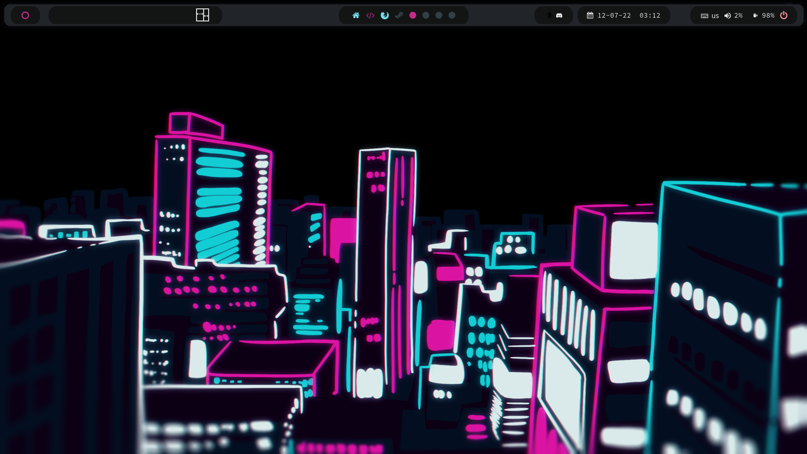
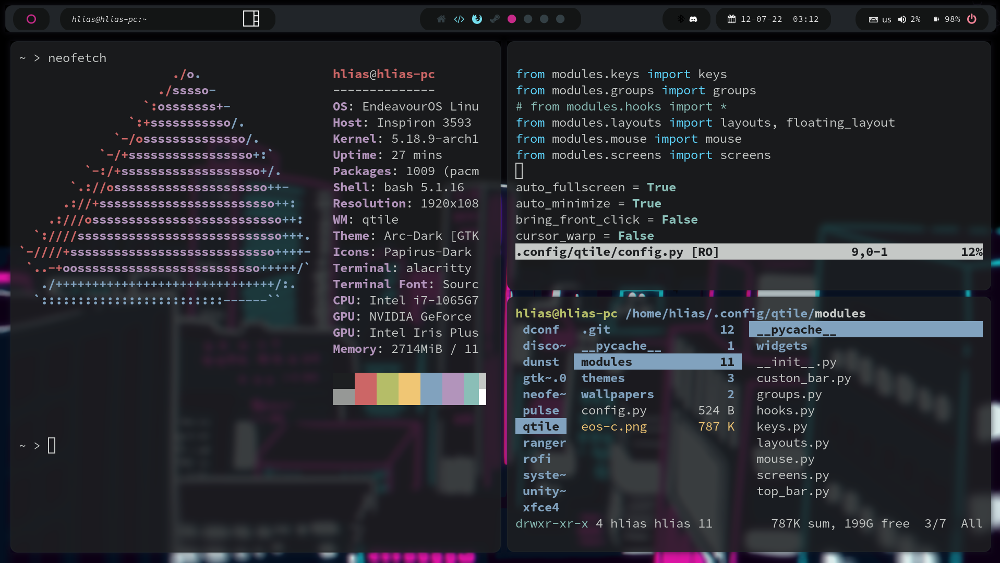

# My config files for qtile

## Previews 

### Stuff I use

Program | What it does
|- | - 
|[alacritty](https://alacritty.org/) | Terminal emulator
|[ranger](https://github.com/ranger/ranger) | File management
|[Source Code Pro](https://github.com/adobe-fonts/source-code-pro) |Font
|[picom](https://wiki.archlinux.org/title/Picom) | Composito
|[qtile](http://www.qtile.org/) | Window manager written in Python
|[rofi](https://wiki.archlinux.org/title/Rofi) | Application launcher / dmenu replacement

 (sorry if there isn't everything here, I'm new to linux and I'm not too familiar with dot files)
